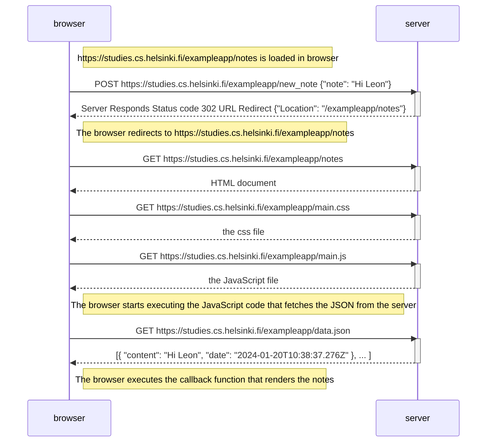

```mermaid
sequenceDiagram
  participant browser
    participant server

    Note Right of browser: https://studies.cs.helsinki.fi/exampleapp/notes is loaded in browser

    browser->>server: POST https://studies.cs.helsinki.fi/exampleapp/new_note {"note": "Hi Leon"}
    activate server
    server-->>browser: Server Responds Status code 302 URL Redirect {"Location": "/exampleapp/notes"}
    deactivate server

    Note Right of browser: The browser redirects to https://studies.cs.helsinki.fi/exampleapp/notes

    browser->>server: GET https://studies.cs.helsinki.fi/exampleapp/notes
    activate server
    server-->>browser: HTML document
    deactivate server

    browser->>server: GET https://studies.cs.helsinki.fi/exampleapp/main.css
    activate server
    server-->>browser: the css file
    deactivate server

    browser->>server: GET https://studies.cs.helsinki.fi/exampleapp/main.js
    activate server
    server-->>browser: the JavaScript file
    deactivate server

    Note right of browser: The browser starts executing the JavaScript code that fetches the JSON from the server

    browser->>server: GET https://studies.cs.helsinki.fi/exampleapp/data.json
    activate server
    server-->>browser: [{ "content": "Hi Leon", "date": "2024-01-20T10:38:37.276Z" }, ... ]
    deactivate server

    Note right of browser: The browser executes the callback function that renders the notes

```
