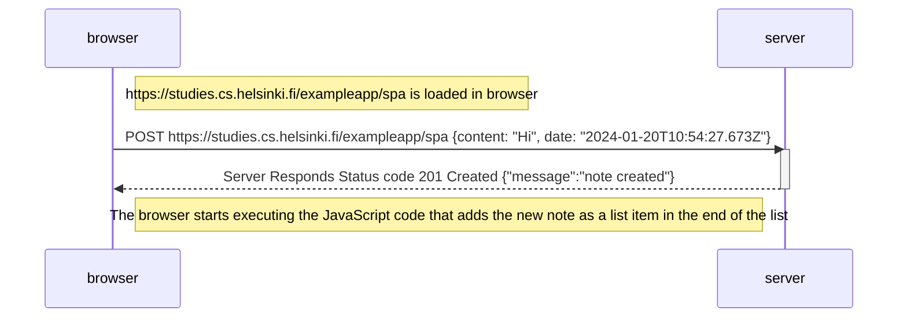

```mermaid
sequenceDiagram
  participant browser
    participant server

    Note Right of browser: https://studies.cs.helsinki.fi/exampleapp/spa is loaded in browser

    browser->>server: POST https://studies.cs.helsinki.fi/exampleapp/spa {content: "Hi", date: "2024-01-20T10:54:27.673Z"}
    activate server
    server-->>browser: Server Responds Status code 201 Created {"message":"note created"}
    deactivate server

    Note Right of browser: The browser starts executing the JavaScript code that adds the new note as a list item in the end of the list

```
